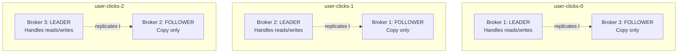
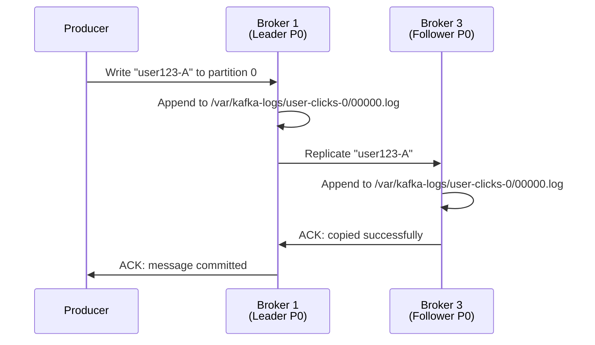
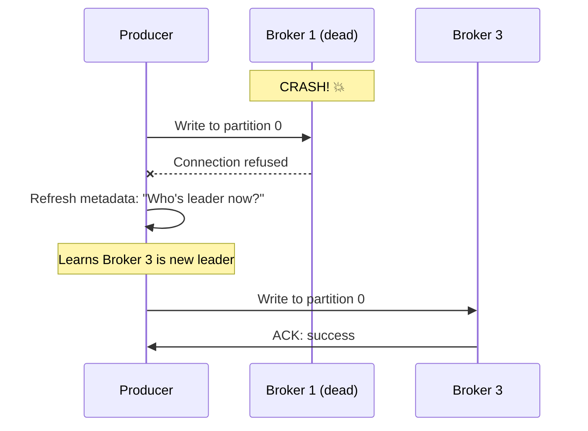
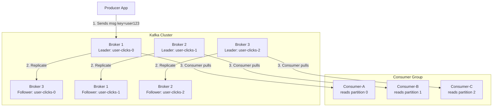

**Kafka Learning Prompt**

Explain Apache Kafka in very simple English as a physical system, not theory.

Teach it step-by-step using a small example with:

* 3 brokers
* 1–2 topics
* 3–4 partitions each
* replication factor 2
* 1 producer
* 1 consumer group with multiple consumers

Follow these rules:

1. Show where data is physically stored (which broker holds which partition).
2. Explain clearly that a broker does NOT store all partitions of a topic.
3. Show how partitions are distributed across brokers.
4. Then explain replication:

   * leader vs follower
   * how data is copied
   * what happens when a broker crashes
5. Show message flow step-by-step:
   Producer → partition leader → replicas → consumers
6. Explain how consumer groups divide partitions among consumers.
7. Show cases:

   * consumers > partitions
   * partitions > consumers
8. Use only Mermaid or ASCII diagrams (no images).
9. After each concept, add 1–2 lines explaining “why this exists”.
10. Focus on clarity and visualization, not definitions or jargon.

---

# Apache Kafka: A Physical Walkthrough

Let me build this system piece by piece, showing you exactly where everything lives.

## Setup: Our Kafka Cluster

We have **3 physical machines** (brokers):
- Broker 1 (192.168.1.10)
- Broker 2 (192.168.1.11)
- Broker 3 (192.168.1.12)

---

## Step 1: Creating Topics and Partitions

Let's create **2 topics**:
- `user-clicks` (3 partitions, replication factor 2)
- `payments` (4 partitions, replication factor 2)

### Physical Storage Layout

```
BROKER 1 (192.168.1.10)
└── /var/kafka-logs/
    ├── user-clicks-0/      (LEADER)
    │   └── 00000.log
    ├── user-clicks-1/      (FOLLOWER)
    │   └── 00000.log
    ├── payments-0/         (LEADER)
    │   └── 00000.log
    └── payments-3/         (FOLLOWER)
        └── 00000.log

BROKER 2 (192.168.1.11)
└── /var/kafka-logs/
    ├── user-clicks-1/      (LEADER)
    │   └── 00000.log
    ├── user-clicks-2/      (FOLLOWER)
    │   └── 00000.log
    ├── payments-1/         (LEADER)
    │   └── 00000.log
    └── payments-2/         (FOLLOWER)
        └── 00000.log

BROKER 3 (192.168.1.12)
└── /var/kafka-logs/
    ├── user-clicks-0/      (FOLLOWER)
    │   └── 00000.log
    ├── user-clicks-2/      (LEADER)
    │   └── 00000.log
    ├── payments-2/         (LEADER)
    │   └── 00000.log
    └── payments-1/         (FOLLOWER)
        └── 00000.log
```

### Key Points:

**Each broker stores ONLY some partitions** - not the entire topic.
- Broker 1 has: `user-clicks-0`, `user-clicks-1`, `payments-0`, `payments-3`
- Broker 2 has: `user-clicks-1`, `user-clicks-2`, `payments-1`, `payments-2`
- Broker 3 has: `user-clicks-0`, `user-clicks-2`, `payments-1`, `payments-2`

**Why?** Spreading partitions across brokers means the work is distributed. No single machine handles everything.

---

## Step 2: Understanding Leaders and Followers



### What This Means:

For **each partition**, one broker is the **LEADER**:
- All writes go to the leader
- All reads come from the leader
- Leader handles all client traffic

The other broker is the **FOLLOWER**:
- Continuously copies data from the leader
- Sits idle, waiting to take over if leader crashes
- Does NOT serve clients

**Why?** If a broker crashes, we don't lose data. The follower can immediately become the new leader.

---

## Step 3: Writing Messages (Producer in Action)

Our producer sends 6 messages to `user-clicks` topic:

```
Producer decides which partition using message key:
- user123 clicks button A → hash(user123) % 3 = partition 0
- user456 clicks button B → hash(user456) % 3 = partition 1
- user789 clicks button C → hash(user789) % 3 = partition 2
- user123 clicks button D → hash(user123) % 3 = partition 0
- user456 clicks button E → hash(user456) % 3 = partition 1
- user999 clicks button F → hash(user999) % 3 = partition 2
```

### Physical Write Flow:



### After All Writes, Physical Storage:

```
BROKER 1 - user-clicks-0/ (LEADER)
00000.log:
  offset 0: user123 clicked A
  offset 1: user123 clicked D

BROKER 2 - user-clicks-1/ (LEADER)
00000.log:
  offset 0: user456 clicked B
  offset 1: user456 clicked E

BROKER 3 - user-clicks-2/ (LEADER)
00000.log:
  offset 0: user789 clicked C
  offset 1: user999 clicked F
```

**Why partitions?** Messages with the same key (like user123) always go to the same partition, keeping order. Each partition can be written to in parallel, making Kafka fast.

---

## Step 4: Replication in Detail

Let's zoom into partition `user-clicks-0`:

```
BEFORE WRITE:
┌─────────────────────────────┐
│ Broker 1 (LEADER)           │
│ user-clicks-0/00000.log     │
│ [msg1][msg2][msg3]          │
└─────────────────────────────┘
          │
          │ replication (continuous)
          ▼
┌─────────────────────────────┐
│ Broker 3 (FOLLOWER)         │
│ user-clicks-0/00000.log     │
│ [msg1][msg2][msg3]          │
└─────────────────────────────┘

NEW MESSAGE ARRIVES:
┌─────────────────────────────┐
│ Broker 1 (LEADER)           │
│ [msg1][msg2][msg3][msg4]←── Producer writes here
└─────────────────────────────┘
          │
          │ Follower pulls this
          ▼
┌─────────────────────────────┐
│ Broker 3 (FOLLOWER)         │
│ [msg1][msg2][msg3][msg4]    │
└─────────────────────────────┘
```

The follower constantly asks: "Leader, got anything new?" and copies it.

**Why?** Data lives on 2 machines. If Broker 1's hard drive dies, Broker 3 has an exact copy.

---

## Step 5: Broker Crash and Recovery

### What Happens When Broker 1 Crashes:

```
BEFORE CRASH:
user-clicks-0: Leader=Broker1, Follower=Broker3
user-clicks-1: Leader=Broker2, Follower=Broker1  ← Broker1 is follower here

BROKER 1 CRASHES! 💥

AFTER CRASH (automatic, takes ~seconds):
user-clicks-0: Leader=Broker3 ← PROMOTED!
user-clicks-1: Leader=Broker2, Follower=NONE (under-replicated)
```

### What Clients See:



**Clients automatically switch to the new leader** - they ask Kafka "who's in charge now?" and get updated.

**Why?** No downtime. The system keeps running even when machines fail.

---

## Step 6: Consumers - Single Consumer

One consumer reading `user-clicks`:

```
CONSUMER-1 reads all 3 partitions:

┌────────────────────────────────────────┐
│ CONSUMER-1                             │
│ (192.168.1.100)                        │
└────────────────────────────────────────┘
    │           │           │
    │           │           │
    ▼           ▼           ▼
┌────────┐  ┌────────┐  ┌────────┐
│Broker 1│  │Broker 2│  │Broker 3│
│Part. 0 │  │Part. 1 │  │Part. 2 │
│offset:2│  │offset:2│  │offset:2│
└────────┘  └────────┘  └────────┘
```

Consumer reads sequentially from each partition:
1. Read partition 0, offset 0 → "user123-A"
2. Read partition 0, offset 1 → "user123-D"
3. Read partition 1, offset 0 → "user456-B"
4. ... and so on

**Why one consumer?** Simple, but slow. It must read from all partitions alone.

---

## Step 7: Consumer Group - Multiple Consumers

**Consumer Group "analytics-team"** with 3 consumers:

```
┌──────────────────────────────────────────────────┐
│ CONSUMER GROUP: analytics-team                   │
├──────────────────────────────────────────────────┤
│ Consumer-A (ID: c1)                              │
│ Consumer-B (ID: c2)                              │
│ Consumer-C (ID: c3)                              │
└──────────────────────────────────────────────────┘

Kafka assigns partitions automatically:
┌───────────────┐     ┌───────────────┐     ┌───────────────┐
│ CONSUMER-A    │     │ CONSUMER-B    │     │ CONSUMER-C    │
│ Assigned:     │     │ Assigned:     │     │ Assigned:     │
│ partition 0   │     │ partition 1   │     │ partition 2   │
└───────┬───────┘     └───────┬───────┘     └───────┬───────┘
        │                     │                     │
        ▼                     ▼                     ▼
    ┌────────┐            ┌────────┐            ┌────────┐
    │Broker 1│            │Broker 2│            │Broker 3│
    │Part. 0 │            │Part. 1 │            │Part. 2 │
    └────────┘            └────────┘            └────────┘
```

**Each consumer gets exclusive partitions.** No two consumers in the same group read the same partition.

**Why?** Work is divided. Three consumers process messages 3x faster than one.

---

## Step 8: Edge Cases

### Case 1: More Consumers Than Partitions (4 consumers, 3 partitions)

```
Consumer Group "analytics-team" - 4 consumers:

┌───────────┐   ┌───────────┐   ┌───────────┐   ┌───────────┐
│Consumer-A │   │Consumer-B │   │Consumer-C │   │Consumer-D │
│Part. 0    │   │Part. 1    │   │Part. 2    │   │ IDLE 😴   │
└─────┬─────┘   └─────┬─────┘   └─────┬─────┘   └───────────┘
      │               │               │
      ▼               ▼               ▼
  ┌───────┐       ┌───────┐       ┌───────┐
  │Part 0 │       │Part 1 │       │Part 2 │
  └───────┘       └───────┘       └───────┘
```

**Consumer-D sits idle** - there's no partition for it. It's a backup; if Consumer-A crashes, Consumer-D takes over partition 0.

**Why this matters:** You can't get more parallelism than you have partitions.

---

### Case 2: More Partitions Than Consumers (2 consumers, 4 partitions)

Using `payments` topic (4 partitions):

```
Consumer Group "payment-processors" - 2 consumers:

┌──────────────────┐        ┌──────────────────┐
│   Consumer-A     │        │   Consumer-B     │
│   Assigned:      │        │   Assigned:      │
│   partition 0    │        │   partition 2    │
│   partition 1    │        │   partition 3    │
└────┬────────┬────┘        └────┬────────┬────┘
     │        │                  │        │
     ▼        ▼                  ▼        ▼
 ┌───────┐ ┌───────┐        ┌───────┐ ┌───────┐
 │Part 0 │ │Part 1 │        │Part 2 │ │Part 3 │
 └───────┘ └───────┘        └───────┘ └───────┘
```

**Each consumer handles 2 partitions.** Consumer-A reads from both partition 0 and 1.

**Why this matters:** Fewer consumers means each does more work. Add more consumers to speed up processing (up to the number of partitions).

---

## Step 9: Complete Message Flow Visualization



---

## Step 10: How Kafka Scales

### Scaling Writes (Add More Partitions):

```
Topic with 3 partitions:          Topic with 6 partitions:
3 producers write in parallel     6 producers write in parallel

P1 → Part0                         P1 → Part0
P2 → Part1                         P2 → Part1
P3 → Part2                         P3 → Part2
                                   P4 → Part3
                                   P5 → Part4
                                   P6 → Part5

Throughput: 3x                     Throughput: 6x
```

**Why?** Each partition is independent. More partitions = more parallel writes.

---

### Scaling Reads (Add More Consumers):

```
1 consumer:                        3 consumers:
reads 100 msg/sec                  each reads 100 msg/sec

Consumer-A → Part0,1,2             Consumer-A → Part0
  ↓                                Consumer-B → Part1
100 msg/sec total                  Consumer-C → Part2
                                     ↓
                                   300 msg/sec total
```

**Why?** Each consumer processes its assigned partitions independently.

---

### Scaling Storage (Add More Brokers):

```
3 brokers, 6 partitions:           5 brokers, 6 partitions:
Each broker: 2 partitions          Each broker: ~1 partition

Broker1: P0, P3                    Broker1: P0
Broker2: P1, P4                    Broker2: P1
Broker3: P2, P5                    Broker3: P2
                                   Broker4: P3
                                   Broker5: P4, P5

Storage per broker: 33%            Storage per broker: 20%
```

**Why?** More brokers = data spreads thinner. No single machine holds too much.

---

## Summary: Where Everything Lives

```
PHYSICAL REALITY CHECK:

┌─────────────────────────────────────────────────────────┐
│ YOUR LAPTOP (Producer)                                  │
│ Sends: "user123 clicked button"                        │
└───────────────────────┬─────────────────────────────────┘
                        │
                        ▼
        ┌───────────────────────────────┐
        │  Which partition? Hash key!   │
        │  hash(user123) % 3 = 0        │
        └───────────────────────────────┘
                        │
                        ▼
┌──────────────────────────────────────────────────────────┐
│ BROKER 1 - Server at 192.168.1.10                       │
│ /var/kafka-logs/user-clicks-0/00000.log                 │
│ [offset 0: user123-buttonA][offset 1: user123-buttonD]  │
│                                                          │
│ This broker ALSO stores:                                │
│ - user-clicks-1 (as follower)                           │
│ - payments-0 (as leader)                                │
└────────────────────┬─────────────────────────────────────┘
                     │
                     │ Replication
                     ▼
┌──────────────────────────────────────────────────────────┐
│ BROKER 3 - Server at 192.168.1.12                       │
│ /var/kafka-logs/user-clicks-0/00000.log (COPY)          │
│ [offset 0: user123-buttonA][offset 1: user123-buttonD]  │
└────────────────────┬─────────────────────────────────────┘
                     │
                     │ Consumer pulls
                     ▼
┌──────────────────────────────────────────────────────────┐
│ CONSUMER SERVER (analytics-1.company.com)               │
│ Reads partition 0, tracks: "I'm at offset 1"            │
│ Processes: user123 clicked buttonA                      │
└──────────────────────────────────────────────────────────┘
```

**Key Takeaways:**

1. **Partitions are the unit of parallelism** - they're physically separate files on different machines
2. **Brokers don't store whole topics** - they store specific partitions
3. **Leaders handle traffic, followers copy silently** - this is how Kafka survives crashes
4. **Consumer groups divide work** - each consumer gets exclusive partitions
5. **Scaling = more partitions + more consumers + more brokers** - all independent
